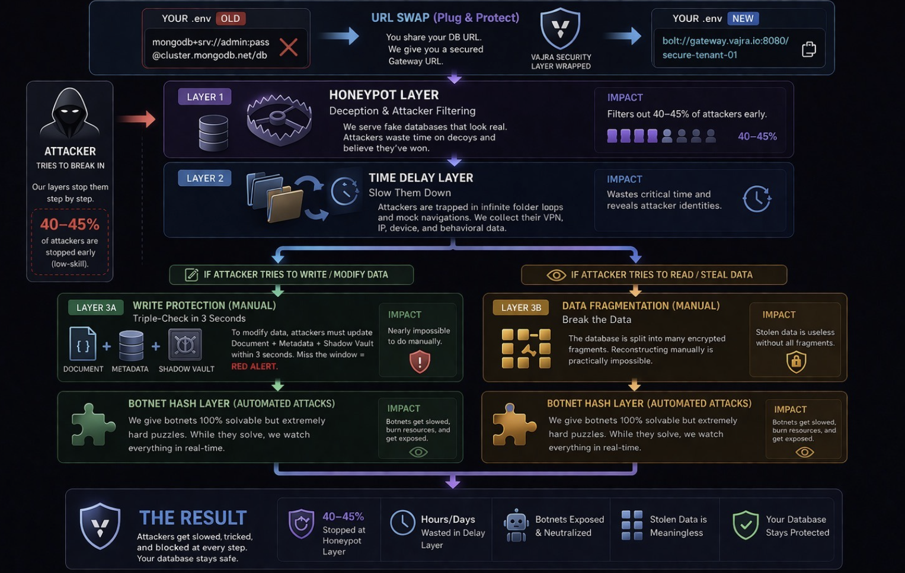

# Vajra: Multi-Layer Cybersecurity Defense System

## Team Members

Nandini Atal  
Navya Jindal  
Aryan Bansal  
Mehak Taneja  

Vajra provides advanced cybersecurity through distributed sharding, intrusion detection, and multi-layer defense.

Python | C++ | React | NGINX

## Important

Demo Video: Embedded-style preview (click to play on YouTube).

[Watch the Vajra demo video](https://www.youtube.com/watch?v=PLACEHOLDER)  
Play Demo on YouTube

## Table of Contents
1. [Overview](#1-overview)  
2. [Why This Project Stands Out](#2-why-this-project-stands-out)  
3. [Architecture](#3-architecture)  
4. [Features](#4-features)  
5. [Layer 1: Fake DB Layer](#5-layer-1-fake-db-layer)  
6. [Layer 2: Resource Tarpit](#6-layer-2-resource-tarpit)  
7. [Layer 3: Chronos Locks](#7-layer-3-chronos-locks)  
8. [Layer 4: Botnet Math Layer](#8-layer-4-botnet-math-layer)  
9. [Layer 5: Bit-Level Fragmentation](#9-layer-5-bit-level-fragmentation)  
10. [Project Structure](#10-project-structure)  
11. [Install and Run](#11-install-and-run)  
12. [Usage Examples](#12-usage-examples)  
13. [Tech Stack](#13-tech-stack)  
14. [Testing](#14-testing)  
15. [Team and Credits](#15-team-and-credits)  
16. [Future Improvements](#16-future-improvements)  

## 1. Overview

Vajra offers 5-layer architecture to protect startups and SMEs against hackers. Startups lack resources for expensive security, so Vajra is cost-effective. It defends against advanced attacks like LLM-based botnets—protection not available in AWS or other cloud systems.

**USP: Plug and Protect Integration**  
Startups provide DB URL; Vajra acts as proxy layer, generates secure URL. No direct use of startup DB—we fully isolate it for fault-safe operation.

**5-Layer Architecture:**
1. **Fake DB Layer**: Decoy database with honeypot data to trap attackers.  
2. **Resource Tarpit**: Slows attackers by serving heavy dummy computations.  
3. **Chronos Locks**: Time-based locks delay requests, preventing rapid attacks.  
4. **Botnet Math Layer**: Math challenges (PoW) block botnets/LLM attacks.  
5. **Bit-Level Fragmentation**: Data sharded at bit level across nodes, impossible to reconstruct without all fragments.

## 2. Why This Project Stands Out

- Cost-effective protection for resource-constrained startups/SMEs  
- Defends advanced LLM-botnet attacks unavailable in cloud services  
- Plug-and-protect proxy—no DB changes needed  
- Fault-safe isolation of production data  
- Scalable 5-layer defense  

## 3. Architecture

```
User Request
     ↓
Fake DB Layer
     ↓
Resource Tarpit
     ↓
Chronos Locks
     ↓
Botnet Math
     ↓
Bit-Level Fragmentation
     ↓
Secure Storage
```



## 4. Features

**Plug and Protect**: Proxy mode with secure URL generation.

## 5. Layer 1: Fake DB Layer

Fake database lures hackers with dummy data. Blocks SQL injection (safe queries, web firewall) and XSS attacks (secure web policies, clean code). Hackers hitting real links get fake data maze. Records everything; tool creates realistic fakes. Ends with: Security report on hacker created.

## 6. Layer 2: Resource Tarpit

Traps hacker from Layer 1 in slow zone. Gives fake heavy work (endless math, fake encryption) that wastes their computer power and time. Real system stays hidden. Web server scripts adjust how slow based on danger. Fingerprints track hacker across visits. Ends with: Hacker slowed down, resources wasted.

## 7. Layer 3: Chronos Locks

Makes hacker wait longer each time they try (like doubling punishment). Secret chain checks if too fast (3 seconds impossible)—shows error, finds hacker's device/VPN location, makes complete report. Stops fast guessing attacks. Ends with: Full tracker report ready.

## 8. Layer 4: Botnet Math Layer

Botnet = army of hacked computers attacking together. Gives hard math puzzle to bots, easy one to people. Bots waste time solving hard puzzle instead of attacking (bad business for attackers). Uses special math codes. Ends with: Bot army stopped by puzzle.

## 9. Layer 5: Bit-Level Fragmentation

Cuts files into tiny bit pieces, stores each piece on separate server. Even all pieces useless without special PIN master key (unique mix code)—without it, data is meaningless mess ('digital coffee'). Key shown to admin once only; developers don't keep it. Ends with: Data safe, can't be put back together.

## 10. Project Structure

```
Vajra/
│
├── cyber_shard_system/   # Distributed storage + frontend
│   ├── backend/
│   └── frontend/
├── MCD/                  # Detection & monitoring system
├── MCD_defense/          # C++ defense backend
├── vajra-mcd/            # Web + config layer
├── command.txt           # Utility commands
└── .gitignore
```

## 11. Install and Run

### 1. Clone the Repository

```
git clone https://github.com/your-username/Vajra.git
cd Vajra
```

### 2. Run Cyber Shard Backend

```
cd cyber_shard_system/backend
pip install -r requirements.txt
python main_server.py
```

### 3. Run Storage Servers

```
cd cyber_shard_system/backend/storage_server1
python server.py
```

Repeat for storage_server2 and storage_server3.

### 4. Run Frontend

```
cd cyber_shard_system/frontend
npm install
npm run dev
```

### 5. Run MCD System

```
cd MCD
python server.py
```

### 6. Run MCD Defense (C++)

```
cd MCD_defense/backend
g++ main.cpp -o server
./server
```

## 12. Usage Examples

- Access frontend at http://localhost:5173  
- Simulate attacks: python MCD/simulate_hack.py  
- Configure proxy: Edit vajra-mcd/config/nginx.conf with DB URL  
- Monitor tarpits: Security Console tab  

## 13. Tech Stack

| Technology | Purpose |
|------------|---------|
| OpenResty (Nginx + Lua) | Tarpits & pattern analysis |
| JS Canvas Fingerprinting | Bot detection |
| PHP Forensic Dossier Engine | Fake DB honeypots |
| Python (Bit-Level Sharding) | Fragmentation layer |
| Distributed SQLite | Secure storage nodes |
| CRYSTALS-Dilithium | Post-quantum signatures |
| PoW Engine | Botnet math challenges |
| SHA-256/Blake3 | Hashing & PoW |
| Crow Framework | C++ defense server |
| Chronos-Lock | Time-based throttling |
| Docker | Deployment |
| OpenCV | Steganography detection |
| Tailwind CSS | UI |
| Gemini API | Attack analysis |

## 14. Testing

- Simulate hacks: python MCD/simulate_hack.py  
- Test tarpit: curl tarpit endpoint  
- Verify fragmentation: Check storage servers  
- Frontend tests: npm test  

## 15. Team and Credits

**Team Members:**  
Nandini Atal  
Navya Jindal  
Aryan Bansal  
Mehak Taneja  


## 16. Future Improvements

- LLM behavioral biometrics  
- AI-driven tarpit adaptation  
- Quantum-safe key management  
- Global threat intelligence sharing  

---
MIT License
